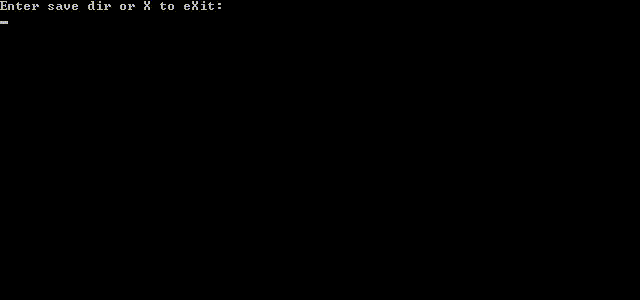

# PARAM.PFD-PS3-Demons-Souls-Savegame-Tool
This script can open and decrypt PS3 savegame files protected by a PARAM.PFD. Furthermore it can re-encrypt modified files and integrate the modifications to the PARAM.PFD (signing). It was meant to be used for (Demon's Souls) savegame files but may work for other situations as well.  
Uses games.conf file to get decryption id.  *(downloaded from public url if not presented).*  




## Overview  
The PFD-SFO/PARAM_PFD.py has all the things you need to do the decrypt / encrypt / sign stuff.  
The vs1 folder is for Visual Studio users.  
The PARAM_SFO.py extracts title and ID from .SFO used to get decryption id and parses it.  
GAMES_CONF.py - games.conf file processing.  
ui.py - user interface.  
The Main.py launches main loop (ui wrapper).  

## Requirements 
- Python 2.7.  
- pycryptodome library:  `pip install pycryptodome`.  

Options to use 2.7 without conflicts if other version is installed:  
- run from IDLE: install 2.7 without integration except for context menu  
- run from cmd-line with pyenv-win.  
- run from Visual Studio and choose existing 2.7 installation as environment. (for developers)  
(uncheck the 2.7 in VS installer as it sets the default version)  

## Limits and TODOS
The tool is able to decrypt / encrypt protected files and resign the PARAM.PFD if files were changed. This is currently only tested for Demon's Souls savegame files. Right now there are these known limitations / TODOS:
* The PARAM.SFO can be parsed using the PARAM_SFO.py but the encryption / decryption is not done yet (reason: it uses some different mechanisms)
* Performance is very low compared to C# decryptor (below). This might be caused by unoptimized code or interpreter specifics.  
* Direct 2to3 port doesn't work / port to python 3.  

## Usage

The options to specify save folder:  

- open `Main.py` in IDLE and edit `save`

if you have `.py` associated with python 2.7:  
- Drag and drop the folder on Main.py.  
- Open Main.py and paste path.  
- cmd: `Main.py folder`.    

else:  
- cmd: `python Main.py folder`. (pyenv-win)

Example usage:

``` python
from PARAM_PFD import PARAM_PFD
# open the param_pfd in the given folder
param_pfd = PARAM_PFD("BLES00932DEMONSS005")

# decrypt the DAT Files from sourcefolder to targetfolder
param_pfd.decryptAllDatFiles("BLES00932DEMONSS005","Decrypted")

# encrypt the DAT Files from sourcefolder to targetfolder
param_pfd.encryptAllDatFiles("Decrypted","Recrypt")

# updates the PFD to fit for the contents of the outputfolder 
# where the encrypted DAT Files are  
param_pfd.rebuildPFD("Recrypt")

```

## Similar projects
C#: [PS3-Save-Decrypter](https://github.com/r3sus/PS3-Save-Decrypter). (faster)  
C: [pfd_sfo_tools](https://github.com/bucanero/pfd_sfo_tools)
/ [pfdtool](https://github.com/SteffenL/pfdtool/tree/develop).  

## Demon's Souls specific part   
The savegame structure seems to use ???USER.DAT(??? are numbers) files of 256kb size each. The numbers imply some kind of hierarchy of the files. Each character has one (or more) .DAT file(s) (mostly these have lower numbers). A character file can be identified by looking at the offset 0xD4 - 0xF3 in a hex editor, which should show the character name. The offsets and adresses / structures which have been identified can be seen in the (./DemonsSouls/SaveGameEditor.py) which can parse a ???USER.DAT character file and print the information.  
The template for the 010 Editor allows to edit decrypted save file easily i.e. select inventory items from dropdown.

Another raw [demon-souls-save-editor](https://github.com/Dartaan/demon-souls-save-editor) (Kotlin).

## Acknowledgments
The knowledge and motivation to build this project was, among others, based on [@Wulf2k](http://www.github.com/Wulf2k) who built a VB Demon's Souls savegame editor, and of course the [PS3DevWiki](http://www.psdevwiki.com/ps3/).  

## Documentation
> original, by BuXXe:

I crawled through many different sources to get a good overview on the structure and mechanisms the PS3 uses to protect its files. In order to make it easier for others to get this insight I created some diagrams. I just wanted to save the knowledge so I did not put a focus on a standardized syntax. The diagrams were created using [Draw.io](http://www.draw.io), even though they don't force any mentioning I just want to put it here cause it is free and a really great toolbox. The draw.io .xml file for al diagrams is in the repo as well.  

#### PARAM.PFD Structure
  
#### PARAM.PFD decryption / encryption mechanisms
  
  
#### PARAM.PFD file modification process
After you have modified a decrypted file using a hex-editor or whatever you encrypt it back. Now you need to do these steps in this order to update the PARAM.PFD:
1. update the file hashes in the protected files table entries
1. update the y table signatures
1. calculate the y table HMACSHA1
1. calculate the tables_header+x table HMACSHA1
1. encrypt the header_table

 
 
 
 
